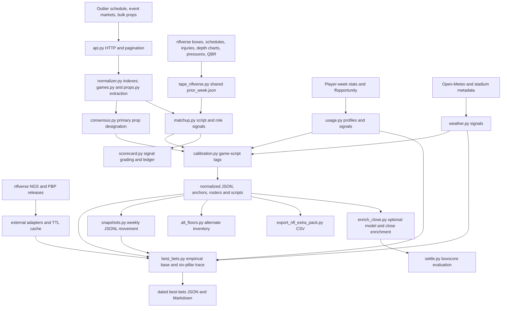

# NFL pipeline forensic debugging report — October 6, 2026

## 1. Executive diagnosis

**The NFL pipeline is not ready for reliable production recommendations or point-in-time historical evaluation.** Its ordinary offline tests pass, but its success, evidence, identity, probability and publication contracts admit incorrect data. The highest priority is to enforce source completeness and a prediction-time boundary before publishing recommendations. Fixing individual exceptions will not address these failures.

This investigation mapped the standalone NFL execution path, inspected its integrations and downstream exporters/settlers, ran the existing NFL tests, traced representative stored records, and reproduced failures with isolated offline inputs. It produced a repair plan and an unapplied candidate diff. **Product code, existing predictions, calibration weights and historical ledgers were not changed.** The patch is a limited first batch, not the full repair plan.

Audited tracked source: `b7638f7213e09d14775544f0b00b557405d99d02`. The canonical sync completed with exit 0, `REPORT STATUS: OK`, and `RUN-NONCE: a9a3207603fc4f24`, UTC `2026-10-06T18:31:22Z`. Existing canonical modifications and untracked helpers were inspected separately and preserved. Findings describe that source and the files observed during this audit; later changes require revalidation.

Strongest observed evidence:

| Evidence | Result | Implication |
|---|---:|---|
| Existing explicit `tests/test_nfl*.py` suite | 452 passed | Existing assertions do not cover the defects below |
| Saved October 4 card | 106 / 674 `VALIDATED` picks have nonpositive emitted EV | Validation label is unreliable even under its own EV calculation |
| Saved October 5 card | 5 / 34 `VALIDATED` picks have nonpositive emitted EV | Same defect persists on a one-game slate |
| September 20 calibrated artifact | All 361 rows written after their game kickoff | Current dated file cannot be used as an original pregame snapshot |
| New offline forensic probes | 19 reproduced defects/contracts | Passing ordinary tests is insufficient evidence of correctness |
| Six-file candidate diff in isolated source copy | 10 repair probes and 112 existing targeted tests passed | Narrow changes work for covered cases; other findings remain open |
| Static checks | Ruff passes; MyPy reports 8 errors in 4 NFL files | Existing type-check workflow omits the NFL package |

`VALIDATED` in the NFL tracer, `TIER_1_ANCHOR` in the NFL export, and actionable Board A in the separate MLB/WNBA pack are distinct contracts. None of this audit establishes a placed bet or a financial loss. Negative-EV examples have zero suggested stake. The code nevertheless labels them validated and ranks them alongside purported recommendations.

Raw market inventory can still be useful where identity, scope, date and price are individually verified. Historical forecast accuracy, model calibration, current starter verification and recommendation approval should not be trusted globally until the affected contracts are repaired.

## 2. Repository architecture

### Actual execution path



`NflPipeline.run()` controls one Eastern-date slate. The CLI optionally calls `_refresh_tape()` **before** `run`; calling `run()` directly does not refresh tape. `weekly.main()` refreshes tape once for the current day, then `run_week()` processes remaining Tuesday-through-Monday slate dates. It does not refresh tape separately for each future date. Future-date tracer picks generally remain provisional because injury/weather validation requires a game-day run.

The shared `outlier_scrapers.daily_job`/pack DAG currently supports **MLB and WNBA**, confirmed by `supported_leagues()`. It does not orchestrate this NFL package. Its SQLite storage, Board A flags, manifest controls and feed-health gates therefore do not automatically protect NFL outputs. The standalone NFL pipeline uses JSON/CSV/JSONL rather than database upserts. No NFL model training, Elo engine, learned forecast service or dashboard/API deployment was found on this execution path.

### Entry points, inputs, outputs and dependencies

| Stage / controlling surface | Input and granularity | Output / current contract | Persistence and downstream use |
|---|---|---|---|
| `pipeline.main`, `NflPipeline.run` | Slate date, optional kickoff window, client/fixtures | Summary; currently `OK` even for certain failed stages | `data/NFL/normalized/summary_*` |
| `api.fetch_schedule` | NFL schedule endpoint | Event objects keyed by provider event ID | Used immediately; raw directory created but no per-run raw archive written |
| `api.fetch_event_markets` | Event ID + GAMELINE/TEAM_PROP | Markets/outcomes with books | `games.extract_game_lines` |
| `api.fetch_player_props` | League bulk paginated feed | Props/outcomes/book quotes | `props.extract_player_props` |
| `normalizer.build_*_index` | Schedule home/away metadata | Event lookup and team ID/alias lookup | Extraction and event membership |
| `models.NflGameLine`, `NflPlayerProp` | Outcome, scope, canonical market, line, books | Typed rows; American odds and percentage implied probability | Normalized JSON and all subsequent consumers |
| `consensus.select_consensus_player_props` | Prop ladder across books | Consensus designation per prop side | Calibration/tracing/floors; duplicate owner keys are not globally enforced |
| `refresh_prior_week_tape` | NFL season boxes, schedule, depth/injury/grade sources | Shared tape envelope with teams, roles, inactives | `data/NFL/tape/prior_week.json`, previous backup |
| `external.load_external_metrics` | NFL season, upper week bound | Source-tagged NGS, team-defense PBP and schedule records | Dated JSON and URL-hash binary cache |
| `usage.load_usage`, `build_profiles` | Player-week actual and expected rows | Per-player usage shares, averages and vacancy/efficiency signals | Dated usage JSON; matchup and tracer |
| `load_slate_weather` | Event kickoff, schedule venue, home coordinates | Forecast/venue record and volume signals | Dated weather JSON; matchup/tracer/floors |
| `build_matchup_scripts` | Market context, tape, inactives and defensive-out lists | Per-event scores, leans and `PropSignal`s | Dated/latest scripts; game-script Markdown |
| `apply_game_script_calibration`, `apply_matchup_signals` | Consensus props and signals | Tags/tier/volume adjustments | Calibrated and high-probability JSON |
| `_trace_best_bets` | Props, scripts, metrics, usage, weather, injuries, snapshots | Separate empirical probability + capped pillar adjustments + verdict | Best-bets JSON/Markdown; weekly merge |
| `projection` / `enrich_close` | Explicit prior-week CSV or close feed | Optional independent `model_p` and price provenance | Enriched prediction artifacts; settlement |
| `scorecard.grade_signals`, `update_ledger` | Scripts, player-week realized stats, prior averages, consensus lines | Direction/line grades; date-replacement ledger | `data/NFL/scorecard/ledger.jsonl` and scorecards |
| `settle_predictions` | Prediction snapshot and completed boxscore events | Grades, probability metrics and optional CLV | Shadow evaluation reports |
| `export_nfl_extra_pack`, local refresh/filter helpers | Anchor JSON / injury helper | Thin `nfl_only.csv`, companions and optional Drive copy | Export/publish path; separate from tracer verdicts |

For repair, quote granularity should be `(run_id,event_id,player_id,market,scope,side,line,book,quote_time)`. A consensus row may combine books only after quote owners and timestamps are validated. Feature granularity should be `(prediction_id,player_or_team_id,as_of_utc,feature_version)`, with explicit source-availability metadata. A ledger record needs the prediction/run identity, not only slate date.

### External integration and environment audit

Outlier endpoints are defined in `constants.py`: `/sportsdata/leagues/NFL/schedule`, `/playerProps`, `/sportsdata/events/{id}/markets`, plus optional matchup/insights/injuries/metadata methods. The main run uses schedule, event markets and props; the existence of other methods does not establish their use. HTTP uses stdlib urllib, a 60-second timeout, up to five retries, jitter and gzip handling. Authentication comes from recognized environment/session surfaces, with the extraction defect in F24. No secret values were printed.

nflverse downloads use release assets for schedules, team/player weekly stats, injuries, depth charts, PFR defensive pressures, QBR, NGS and PBP. Usage additionally reads ffopportunity expected yards. The main run does **not** use snap counts, complete player participation, FTN blocking/coverage grades, a live betting-split feed, or a comprehensive injury/inactive roster provider merely because these appear in research documentation. NGS/derived pressure grades are not PFF offensive-line grades. Some sources are fetched solely for context, while the tracer actually uses PBP EPA/separation; statements about source coverage must name the consuming path.

External binary cache has a 24-hour TTL; tape is a shared replaceable file; boxscore-provider CSV caches have no expiration. Download/parse failure isolation is implemented but does not supply reliable source-completeness metadata. Environment/configuration includes session/token/cookie paths, `OUTLIER_NFLVERSE_CACHE`, optional Odds API credentials for close capture, and CLI data/reports directories. The NFL client should not be assumed to load `.env` identically to the generic scraper; use documented environment loading or an explicit CLI bootstrap. Standalone data/report defaults are relative to the working directory, while some exporter and scheduler paths are canonical absolute paths. Verify deployment CWD and interpreter explicitly.

`scripts/run_nfl_weekly_snapshots.ps1` defines optional task installation for Tuesday 10:00/18:00, Thursday 15:00, Sunday 10:30 and Monday 15:00 **machine-local time**. Its existence is not proof those tasks are installed or the host clock is Eastern. No scheduled tasks were installed or executed in this audit. CI runs core tests, but the checked-in typecheck workflow explicitly targets `outlier_scrapers`.

## 3. Critical findings

Severity and confidence are separate. **Confirmed** means direct source evidence or an offline reproduction; it does not automatically mean a particular historical prediction was contaminated. **High-confidence** marks unexecuted concurrency hazards. No financial losses are inferred from output labels.

### F01 — Predictive sources admit future information

**Severity:** Critical. **Confidence:** Confirmed executable path; specific archived impact unproven.

**Location:** `pipeline.py:273-276,341-346`; `best_bets.py:223-231,254-300`; `usage.py:103-108`.

**Evidence:** External metrics are loaded through week 22. A September `TraceInputs` accepts NGS weeks 1 and 18. When the external schedule is unavailable, `load_usage(..., None)` includes future weeks: a Week 4 example changes receiving yards/game from 66.7 to 175.0 when Week 9 data is present.

**Root cause:** Target date is not an enforced source-availability cutoff; missing cutoff means unbounded history. **Downstream impact:** Volume, receiver separation, opponent EPA and league normalization change with future observations. **Affected data:** Historical/replayed traces and usage; late same-week refreshes and postseason fallback need separate review.

**Recommended fix:** Introduce required aware `as_of_utc`; filter by completed game identity/time and archived source availability. Pass it into adapters, usage, `_Sources`, snapshot lookup and all feature joins. Missing verified cutoff must yield an unavailable stage, never `None` as “all history.” Keep schedule identity/environment separate from postgame fields. **Verification:** Inject future-week, later same-day and corrected-after-cutoff rows; predictions must remain unchanged.

### F02 — Tape, injury and depth-chart evidence is not point-in-time safe

**Severity:** Critical for historical predictions. **Confidence:** Confirmed.

**Location:** `tape_nflverse.py:246-297,502-512`; `matchup.py:107-134`; `pipeline.py:258,297,300,351`.

**Evidence:** A 23:00 depth snapshot is accepted for that morning's date because only `dt[:10]` is checked. Injury `date_modified` is ignored. Missing local tape returns 32 teams from packaged Week 1, 2026 data. Current shared tape has `before=2026-10-01` and `injury_report_loaded=true`, while October 4/5 outputs exist.

**Root cause:** Loaders discard envelope provenance and confuse “loaded at some time” with admissible/current evidence. **Downstream impact:** Wrong starter, vacancy, defensive-injury boost and role signals; historical leakage. **Affected data:** Tape-derived scripts, tracer injury pillar, floors and rosters. The shared October 1 tape does not prove which exact injury version older runs used.

**Recommended fix:** Return a structured tape envelope; retain season, phase, cutoff, observed/fetched time, hashes and per-source statuses. Parse full timestamps. Reject wrong-season/future/stale/unproven injury evidence for approval. Allow bundled tape only through explicit fixture/research mode. **Verification:** Morning versus evening snapshots, future injury updates, wrong season, corrupt tape and missing tape.

### F03 — Required failures and validation errors still publish `OK`

**Severity:** High. **Confidence:** Confirmed.

**Location:** `pipeline.py:218-247,386-420,607-633,668-689,931`; `weekly.py:77-83`.

**Evidence:** All market/prop fetches failing for three scheduled events yields `OK`, zero records and `errors=[]`. Injected normalized validation errors still publish latest artifacts and return `OK`. Optional failures are often warnings only; CLI returns 0.

**Root cause:** Validators are logging helpers rather than publication gates; required stage errors are not propagated. **Downstream impact:** Failed jobs and incomplete slates look successful to automation and consumers. **Affected data:** Any run hitting fetch/schema failures; failed stage can replace a previous good latest file.

**Recommended fix:** Add required/optional stage receipts with coverage/completeness. Invalid schedule/required ingestion/schema stages must stop recommendation publication and return nonzero. Publish an explicit failed/partial summary; retain or invalidate latest pointers deliberately. `weekly` must reject non-OK required stage receipts, not merely best-bets exceptions. **Verification:** Page failures, event-market failures, malformed props, invalid normalized rows and genuinely empty scheduled slate must have distinct outcomes.

### F04 — Pagination suppresses incomplete feeds

**Severity:** High. **Confidence:** Confirmed.

**Location:** `api.py:483-526`.

**Evidence:** Page 1 advertises two pages; all page-2 requests fail; client returns page 1 as success. Repeated cursors and page caps also exit without completeness proof.

**Root cause:** Alternate query discovery catches API failures, then breaks and returns accumulated rows. **Downstream impact:** Missing players/lines masquerade as complete inventory. **Affected data:** Bulk player props/insights on failure, cap or cursor stall.

**Recommended fix:** Introduce incomplete-pagination error/receipt. Propagate transport/auth/rate-limit failure, validate list schema, distinguish unsupported parameter from failed page, and verify continuation/counts. Fail cap exhaustion with remaining pages. Replace first/last-ID fingerprinting with stable complete-page identities. **Verification:** Exhausted 429/500, repeated cursor, page cap, overlap and changed middle-page records.

### F05 — Positive no-vig edge approves negative expected return

**Severity:** High. **Confidence:** Confirmed in code and stored cards.

**Location:** `best_bets.py:632-646,714-715`.

**Evidence:** Model p=.51 with -110/-110 gives fair p=.50, positive edge=.01, EV=-.0264 and price `VERIFIED`. Saved cards contain 106 such nonpositive-EV validated rows on October 4 and five on October 5.

**Root cause:** Gate compares p to de-vig fair probability rather than requiring a profitable offered quote. **Downstream impact:** Incorrect `VALIDATED` labels, rankings and exports; zero Kelly stake does not repair the approval label. **Affected data:** Traced cards; this does not prove bets were executed.

**Recommended fix:** Require finite positive expected return at the actual quote. Keep no-vig edge as a separate diagnostic. Candidate diff adds `or ev <= 0`; integer-line approval also requires F07's push model. **Verification:** p=.51 must reject -110; p above actual break-even can pass with other evidence verified. Rebuild card verdicts without altering original recommendation records.

### F06 — Projection hierarchy overwrites successful v2 probabilities

**Severity:** High. **Confidence:** Confirmed.

**Location:** `projection.py:378-385`.

**Evidence:** Gaussian direct p=1.0 becomes empirical p=.285714 in the hierarchy, while `model_p_method=gamelog_gaussian` and `n_games=3` survive.

**Root cause:** Success check recognizes only v1 rate source, excluding Gaussian and Poisson. **Downstream impact:** Wrong probability and contradictory provenance in enrichment/evaluation. **Affected data:** Explicit hierarchy-mode enrichment with at least three usable prior games; ordinary pipeline does not call this hierarchy.

**Recommended fix:** Accept all three successful projection sources; clear stale method/count metadata when falling back. Candidate diff covers source recognition and overwrite metadata cleanup. Also honor `overwrite=False` consistently. **Verification:** v1, Gaussian, Poisson, existing external p, and unavailable projection fallback must preserve coherent value/source/method/count.

### F07 — Integer Poisson UNDER includes push probability

**Severity:** High. **Confidence:** Confirmed.

**Location:** `projection.py:261-266`; `best_bets.py:633-636`.

**Evidence:** Mean=2 receptions, UNDER 2 gives .676676; strict win probability is .406006 and push mass .270671.

**Root cause:** `1-P(X>line)` is `P(X<=line)`. **Downstream impact:** Wrong probability and incompatible EV/kelly when a discrete push is possible. **Affected data:** Integer count lines using v2; integer-line tracer EV has no explicit push contract.

**Recommended fix:** Strict under uses `1-_poisson_sf_gt(mean, ceil(line)-1)`; candidate diff covers that calculation only. Add `p_win,p_push,p_loss` to projection/output contracts; EV=`p_win*(decimal-1)-p_loss`. Keep integer approval unavailable until probability semantics are coherent. **Verification:** Integer/half-line cases, zero-rate cases and win+push+loss=1; pushes must not enter binary score losses.

### F08 — Anytime-TD projection counts passing touchdowns

**Severity:** High. **Confidence:** Confirmed.

**Location:** `projection.py:111-116`.

**Evidence:** QB with two passing TDs and zero scored TDs returns actual 2. **Root cause:** Scorer and passer statistic families mixed. **Downstream impact:** Inflated scorer projections. **Affected data:** Explicit gamelog ANYTIME_TD projections, not proven in ordinary empirical cards.

**Recommended fix:** Remove `passing_tds`; validate scored-TD component availability instead of converting missing components to zero. Candidate diff removes the incorrect term. **Verification:** Passing-only QB, rushing QB, receiving player and return scorer examples; reconcile settlement and projection mappings.

### F09 — FIRST_TD settles using anytime totals

**Severity:** High. **Confidence:** Confirmed.

**Location:** `boxscore.py:231-246`.

**Evidence:** FIRST_TD with one rushing TD returns 1 without scoring order. Anchor files contain 20 FIRST_TD rows September 27, 41 October 4 and seven October 5.

**Root cause:** Both scorer market families share an aggregate-stat branch. **Downstream impact:** A later scorer can be graded a first-scorer winner. **Affected data:** FIRST_TD evaluations; actual settlement corruption requires locating affected reports.

**Recommended fix:** Remove FIRSTTD from aggregate grading; mark unsupported until verified play/scoring sequence exists. Candidate diff does this. **Verification:** Non-first scorer with one TD must be skipped, never graded as FIRST_TD win. Regrade affected evaluations from appropriate event data.

### F10 — Scope contracts mix partial games and full games

**Severity:** High. **Confidence:** Confirmed.

**Location:** `config.py:658-680`; `settle.py:63-87,220-273`.

**Evidence:** Q1/H1/1ST_QUARTER/OT parse as full game. Matchup context already excludes correctly classified partial-game lines (`matchup.py:262`), but this cannot protect against incorrect normalization. Settlement drops scope and can grade `--all-calibrated` partial-game predictions with whole-game stats. October 4 calibrated file contains 21,358 non-full-game rows.

**Root cause:** Unknown scope defaults to full game; downstream contracts do not carry/enforce period identity. **Downstream impact:** Wrong selection eligibility, context and grades. **Affected data:** Unknown period encodings and all-calibrated partial-period settlement.

**Recommended fix:** Recognize provider encodings; explicit unrecognized labels become unknown. Reserve full-game default for absent/recognized full-game labels. Preserve the existing full-game context filter. Carry scope in `PredictionSnap` and skip unsupported periods before grading. **Verification:** Raw period payload through normalization/ranking/export/settle, including OT; quarter market with more book coverage must not replace game context.

### F11 — Dated publication overwrites historical and full-slate identity

**Severity:** High. **Confidence:** Confirmed in probes and stored files.

**Location:** `pipeline.py:291,419-425,485-553,673-677`; `scorecard.py:260-273`.

**Evidence:** A full fixture scripts file count=3 becomes count=1 after a 1pm run despite latest protection. September 20 dated calibrated file contains 361 rows emitted 03:57Z for 00:20Z kickoff; ledger for that date covers six games while the current scripts cover one.

**Root cause:** Window runs write bare-date files before suffixed files; replaceable dates are used as prediction/replay identities. **Downstream impact:** Original pregame data disappears; rerun can replace a wider date's grading with partial inputs. **Affected data:** Dated replay/scorecard inputs and window refreshes.

**Recommended fix:** Compute one run suffix before **all** writes; window runs must not write bare-date outputs/reports. Store immutable `runs/<run_id>` payloads plus manifest/input hashes, and atomically publish a pointer only after required validation. Reject post-kickoff actionable publication; retain postgame research separately. Pin ledger replacement to prediction/run/slate scope. **Verification:** Full→window preserves bare-date bytes; after-kickoff runs cannot replace pregame originals; partial replay cannot delete unrelated rows.

### F12 — Close joins cross known game boundaries

**Severity:** High. **Confidence:** Confirmed.

**Location:** `fetch_odds_close.py:437-446`; `enrich_close.py:194-202`.

**Evidence:** Unique player/market/line/side allows a known KC@BAL close to be rewritten/attached to SF@LAR. Ambiguity guards for multiple records do not protect a single known incompatible owner.

**Root cause:** Short-key fallback drops event/date, and index payload discards owner metadata. **Downstream impact:** Wrong close price, CLV and evaluation identity. **Affected data:** Aligned/enriched closes with mismatched owner or name collision.

**Recommended fix:** Carry game/date/team/player ownership through indexing; require canonical team pair/date or explicit provider ID crosswalk. A provider ID difference alone is not a conflict, but incompatible known matchup/date is. Reject contradictions before alignment and fallback attachment. **Verification:** Single incompatible close, same player in different weeks, two same-name players, different-provider IDs for the same validated game.

### F13 — Generic odds capture becomes `book_close`; CLV compares different lines

**Severity:** High for provenance; Medium for CLV measurement. **Confidence:** Confirmed.

**Location:** `fetch_odds_close.py:306,359-373`; `enrich_close.py:154-158`; `settle.py:463-466`.

**Evidence:** Capture mapper/index stamps book_close without quote timing proof. Market/book update times and historical capture metadata are discarded. Bet line 87.5 versus close 187.5 still reports a valid price CLV (+7.39 implied points in a fixture).

**Root cause:** Price-source label is assigned by mode; probability differences ignore threshold comparability. **Downstream impact:** False closing-price attribution and misleading performance evidence. **Affected data:** Close enrichment and CLV reports.

**Recommended fix:** Preserve quote/capture time, kickoff, sportsbook and snapshot provenance. Preserve or explicitly reject supplied `close_source`; never relabel a synthetic/snapshot source as `book_close` during indexing. Verify pre-kickoff last eligible quote under a declared close policy. Compare price CLV only for same market/side/line/scope and compatible price units; report line movement separately. **Verification:** Early capture, after-kickoff quote, unknown timing, supplied synthetic source, changed line and percentage/fraction units.

### F14 — Missing realized statistics become zero

**Severity:** High. **Confidence:** Confirmed.

**Location:** `scorecard.py:60-75,202-217,248-253`; composite projection helpers also default missing values to zero.

**Evidence:** `_actual({}, 'REC_YDS')` returns 0; an UNDER signal can therefore win against a positive prior baseline with no statistic available.

**Root cause:** Parsing uses zero as the missing/invalid default. **Downstream impact:** False wins, false historical averages and direction accuracy. **Affected data:** Scorecard rows with missing/malformed stats; specific prior grades require source review.

**Recommended fix:** Return `None` for absent/invalid/nonfinite required stats; skip with a reason. Require every composite component or a source-specific documented zero contract. Avoid `or 0` when computing historical reference values. **Verification:** Blank, NA, malformed, infinite and explicit zero values produce distinct results; missing actual never grades W/L/P.

### F15 — Boxscore source cache never updates

**Severity:** High. **Confidence:** Confirmed code path; no existing local provider cache found.

**Location:** `boxscore_nflverse.py:51-54,69-85`.

**Evidence:** Any nonempty existing CSV is reused permanently. **Root cause:** Existence/nonempty is treated as freshness/completeness. **Downstream impact:** Later games, delayed stats and corrections never arrive; partial files persist. **Affected data:** Future uses of provider cache; existing cache corruption is not established.

**Recommended fix:** Explicit refresh/TTL, bounded retry, schema/count validation, fetched-at/hash metadata and atomic download/decompression. Never replace a known valid source with an unvalidated partial file. **Verification:** Early-season→later-week update, stat correction, truncated gzip, refresh failure and repeat refresh idempotency.

### F16 — January/February settlement chooses the wrong season

**Severity:** High. **Confidence:** Confirmed.

**Location:** `boxscore_nflverse.py:275`; `settle.py:630`.

**Evidence:** January 10, 2027 fetch and February CLI select season 2027. **Root cause:** Calendar year used despite NFL season crossover; CLI overrides the provider default. **Downstream impact:** Missing/wrong-year stats and skipped games. **Affected data:** January/February regular/postseason settlement without explicit season.

**Recommended fix:** Reuse `nfl_season_for_date`; pass `args.season` unchanged when absent so provider infers. Candidate diff covers both sites. **Verification:** January regular season, Wild Card, February Super Bowl and explicit season override.

### F17 — Entity joins permit foreign teams and name collisions

**Severity:** High. **Confidence:** Confirmed.

**Location:** `props.py:45,76-99`; `normalizer.py:116-117`; `boxscore_nflverse.py:151-161,198-212`; `projection.py:139-168`.

**Evidence:** KC-BUF prop team MIA receives opponent KC; numeric/string team IDs fail equivalence. Two distinct same-name players (80 and 30 yards) become one 110-yard boxscore entry. Projection indexes by normalized name without an explicit season/unique player-game contract.

**Root cause:** Ad hoc names and raw ID types substitute for referential identity. **Downstream impact:** Wrong matchup context, results or probabilities; dropped legitimate rows. **Affected data:** Mixed-schema, traded/same-name and historical inputs.

**Recommended fix:** Normalize all provider IDs to strings; preserve provider namespace. Resolve teamId/id consistently; require team membership in the event before assigning opponent. Do not substitute outcome ID for event ID. Join player results/projections by stable player ID+team+season+game, and permit name fallback only when ownership is uniquely validated. **Verification:** Foreign team, numeric/string IDs, ID-only team objects, duplicate names, trades and multiple seasons; assert joins do not multiply rows.

### F18 — Static rosters are treated as current verification

**Severity:** High. **Confidence:** Confirmed implementation, specific starter mistakes unproven.

**Location:** `roster.py:551-568,666-673,715-729,772-777`; `matchup.py:162-206`.

**Evidence:** Fixed 2026 tables are fallback for any date/season. Most-book-count passer becomes starting QB; offseason move table can override supplied identity.

**Root cause:** Roster membership, probability of starting and verified active status are conflated. **Downstream impact:** Wrong QB/role signals, historical personnel and floor eligibility. **Affected data:** Missing tape/feed identity and starter uncertainty.

**Recommended fix:** Version rosters/depth/inactives by season/time and stable ID. Remove static tables from authoritative validation; retain fixtures explicitly. Emit `probable`, `confirmed`, `unknown` with sources. **Verification:** Backup receives more quotes, trade, IR/PUP/practice squad, inactive starter and past-season replay.

### F19 — Live taxonomy names bypass intended consumers

**Severity:** High for missed advertised integration. **Confidence:** Confirmed in stored data.

**Location:** `config.py:519-529`; `props.py:63`; `weather.py:246`; `best_bets.py:85-88`.

**Evidence:** Raw LONGEST_PASSING_COMPLETION remains uncanonicalized: 39/414/39 rows on October 1/4/5. PASSING_COMPLETIONS remains raw: 84/855/82. Weather emits LONG_PASS, so exact joins miss longest-passing rows.

**Root cause:** Tests inject canonical tokens and omit raw-ingestion-to-consumer paths. **Downstream impact:** Fetched/available context does not influence intended markets. **Affected data:** Normalized, calibrated, roster, traced and export market families.

**Recommended fix:** Add observed aliases and canonical idempotency; use a shared market capability matrix across signal/projection/settle paths. Candidate diff adds four observed aliases, not the entire matrix. **Verification:** Raw payload→normalize→weather→signal→export/settle. Rebuild affected derived outputs from admissible raw snapshots.

### F20 — Market context uses wrong market family or ladder extreme

**Severity:** High. **Confidence:** Confirmed.

**Location:** `games.py:397-428`; `calibration.py:319-352`.

**Evidence:** TEAM_PROP RUSHING_YARDS 120 becomes canonical POINTS 120. Separately, adding unpriced alternate BUF +10.5/KC team total 34.5 flips deficit risk despite primary +2.5/24.5.

**Root cause:** Every TEAM_PROP is classified as a points total; calibration uses maxima instead of verified primary prices. **Downstream impact:** Fabricated units in game exports and wrong RB/receiver adjustment triggers. **Affected data:** Nonpoints team props and alternate-rich boards. The current matchup context additionally checks raw proposition, so the rushing example does not prove that specific context consumed fabricated points.

**Recommended fix:** Change broad team-prop branch to `elif is_team_total(raw_prop)`; explicitly classify/reject other families. Centralize primary full-game market selection using valid quoted two-way evidence/book coverage, and reuse it in calibration/context/rendering. **Verification:** Adding alternates cannot alter primary environment; yardage never becomes points; team ownership must resolve.

### F21 — Unknown outdoor weather validates as neutral evidence

**Severity:** High. **Confidence:** Confirmed.

**Location:** `weather.py:122-155,214-227`; `best_bets.py:508-535`.

**Evidence:** Empty forecast becomes all-null outdoor conditions with zero adjustment; on game day a loaded injury dictionary makes the pillar VERIFIED.

**Root cause:** Nonempty record presence is used as availability/quality proof. **Downstream impact:** Unsupported weather and neutral/retractable venue evidence can approve picks. **Affected data:** Empty/partial forecast or unresolved venue/roof runs.

**Recommended fix:** Explicit forecast status, observation time, venue/roof provenance and required finite conditions. A fixed verified indoor venue can legitimately have no outdoor forecast; unknown venue/roof cannot. Zero adjustment must remain distinct from unavailable input. **Verification:** Empty hourly arrays, missing columns, partial window, neutral/international venue and retractable roof unknown.

### F22 — Usage compares different samples and role histories

**Severity:** Medium/High. **Confidence:** Confirmed.

**Location:** `usage.py:125-156,224-235`.

**Evidence:** Actual [100,100,0] versus expected only weeks 1/2 [100,100] triggers false -33% cold efficiency. A traded player's old-team volume is labeled with the latest team.

**Root cause:** Actual/expected means have different denominators; current-role context uses full mixed-team history. **Downstream impact:** Incorrect efficiency and vacancy adjustments. **Affected data:** Partial ffopportunity coverage, trades and role changes.

**Recommended fix:** Pair actual/expected on validated season/phase/player/game before averaging; retain full-history usage separately and expose coverage. Segment current-team/role samples without silently erasing earlier history. **Verification:** Partial/missing expected rows, disjoint seasons, trades and duplicate player-games.

### F23 — Alternate floors accept unquoted and unverified players

**Severity:** High for recommendation eligibility. **Confidence:** Confirmed.

**Location:** `alt_floors.py:73-86,140-182,253-266`.

**Evidence:** No book quote becomes implied .50; a no-quote floor receives target_odds=None and score=.8873. Grouping/consensus uses name+market rather than event/player identity; no shared inactivity eligibility gate is passed.

**Root cause:** Inventory and priced eligible candidates share one ranking path. **Downstream impact:** Invented price evidence, wrong-event comparison and inactive-player floors. **Affected data:** Floor JSON/CSV/reports; score is not a calibrated probability.

**Recommended fix:** Executable rows require finite valid actual quote, event/player/scope identity and admissible injury/role evidence. Keep unquoted rows as explicitly non-actionable inventory. Replace keys with event+player+market+scope; preserve actual fallback sportsbook. **Verification:** Missing odds, NaN, stale quote, inactive RB, same name across events and target-book absent.

### F24 — Arbitrary session metadata is extracted as bearer token

**Severity:** High. **Confidence:** Confirmed.

**Location:** `api.py:114-143,180-181`.

**Evidence:** Cookie-only state with origin `https://app.outlier.bet` and empty localStorage returns that URL as its token. **Root cause:** Any recursively encountered long string is allowed as credential. **Downstream impact:** Invalid Authorization can poison valid session discovery and produce authentication failures. **Affected data:** Sessions with no recognized token or unrelated long metadata.

**Recommended fix:** Restrict scalar token extraction to recognized credential fields/localStorage entries; preserve cookie-only auth. Decode structured JSON without treating arbitrary scalar strings as credentials. **Verification:** Empty storage, long origin/messages, nested real auth entry, JWT and cookie-only state. Do not log extracted secrets.

### F25 — Requested-date export can silently use another slate

**Severity:** High. **Confidence:** Confirmed source path.

**Location:** `scripts/export_nfl_extra_pack.py:88-94,145-163,187`.

**Evidence:** Missing requested-date source falls back to latest; corrupt input warns and writes header-only CSV, while main returns success. Export fields omit run/event/player IDs and tracer verdict/actionability.

**Root cause:** Convenience fallback and empty output are not distinguished from fulfilled explicit-date export. **Downstream impact:** Wrong-date or empty Drive input appears as a successful refreshed pack. **Affected data:** Missing/corrupt dated anchor input and downstream copied CSV.

**Recommended fix:** Explicit date requires exactly that validated date/run; mismatch/missing/corrupt input returns nonzero. Include immutable run/event/player identity and explicit approval/inventory status; do not infer approval from anchor tier. **Verification:** Requested missing date with another latest present, corrupt JSON, valid empty slate and mismatched payload date. Exercise publish in scratch only.

### F26 — Duplicate/schema failures lack enforced ownership and coverage

**Severity:** High. **Confidence:** Confirmed examples, current upstream compatibility uncertain.

**Location:** `tape_nflverse.py:98-102,147-181`; `boxscore_nflverse.py:198-200`; `schema.py:260-278`.

**Evidence:** Duplicate KC team-game contributes twice while a lookup collapses its key. Missing game_id column can emit completed game with no players. Normalized validation does not enforce dataset primary-key uniqueness or membership. Stored outcome-key duplicates have conflicting book payloads.

**Root cause:** Successful parsing means accepted schema; list iteration and collapsed dictionaries use different multiplicities. **Downstream impact:** Biased aggregate grades, dropped players and unstable last-write joins. **Affected data:** Duplicates, changed source schemas and partial boxes.

**Recommended fix:** Validate required headers, finite values and unique `(game_id,team)` / player-game keys before caching; require two symmetric teams per game. Deduplicate identical source rows with logged counts; conflicting versions need explicit resolution. Validate normalized quote ownership and dataset counts. **Verification:** Header loss, identical/conflicting duplicates, missing opponent and row-count assertions before/after every join.

### F27 — Concurrency and cross-artifact consistency are not guaranteed

**Severity:** High. **Confidence:** High-confidence race paths; races not executed.

**Location:** `external/common.py:39-43`; `tape_nflverse.py:603-613`; `scorecard.py:260-273`; `snapshots.py:77-101`; pipeline multi-file publication.

**Evidence:** Fixed temporary names and unlocked ledger read-modify-write; JSON files are individually atomic but no committed run bundle/pointer exists. Snapshot append has no run uniqueness/serialization contract.

**Root cause:** Per-file atomicity is substituted for transactional run state. **Downstream impact:** Lost ledger dates, cache/temp collision and mixed-run readers. **Affected data:** Overlapping scheduled/manual jobs and crashed multi-file runs; specific corruption unproven.

**Recommended fix:** Reuse existing unique-temp/safe-replace helper; serialize shared tape/ledger/snapshot writers with bounded locks. Build immutable staged run bundle, validate it, then atomically publish one manifest pointer. Repeated same run IDs must not duplicate observations. **Verification:** Offline concurrent writes, crash between files, stale lock recovery and two same-input runs.

### F28 — NFL static checks are absent from the production CI gate

**Severity:** Medium. **Confidence:** Confirmed.

**Location:** `.github/workflows/typecheck.yml`; `Makefile`; current `matchup.py`, `enrich_close.py`, `fetch_odds_close.py`, `settle.py`.

**Evidence:** Workflow/Makefile target only outlier_scrapers; explicit `python -m mypy outlier_nfl` reports eight errors across four files. Ruff passes.

**Root cause:** NFL package added outside the established type-check target. **Downstream impact:** Interface/optional-value errors evade the required static gate. **Affected data:** CI assurance rather than proven output corruption.

**Recommended fix:** Narrow optional values into named variables; type enrichment functions consistently as mutable mappings or dicts; include both packages in MyPy/Pyright CI after baseline repair. **Verification:** Python 3.11 frozen-dependency CI plus local supported version; no suppression of genuine contract errors.

### F29 — Postseason and older-season contracts are incomplete

**Severity:** High for advertised whole-season reliability. **Confidence:** Confirmed exclusions.

**Location:** `external/schedule.py:34`; `external/ngs.py:43`; `external/pbp.py:63`; `tape_nflverse.py:137,235,255`; `scorecard.py:173,234`.

**Evidence:** Multiple adapters/graders explicitly retain REG only; playoff week resolver returns None. Fixed roster and modern depth-chart parser are not a legacy-season contract.

**Root cause:** Regular-season week is the implicit global phase identity. **Downstream impact:** Missing playoff injuries/features/results or fallback to old regular-season evidence. **Affected data:** Wild Card/Divisional/Conference/Super Bowl and older depth schemas.

**Recommended fix:** Carry season_type/game_type separately from week; derive identity from schedule. Explicitly reject unsupported phases before publication until adapters are covered. Build legacy depth adapter rather than treating old fields as empty new schema. **Verification:** January regular season, each playoff round, bye, international/neutral game and pre-2025 depth snapshot.

### F30 — Nonfinite and untracked helper contracts bypass safeguards

**Severity:** Medium for malformed grades; High for claimed injury protection. **Confidence:** Confirmed.

**Location:** `boxscore.py:250-266`; `games.py` numeric conversion; untracked canonical `outlier_nfl/injuries.py:145-153,181-209,236-272` and `scripts/filter_nfl_ruled_out.py`.

**Evidence:** NaN line grades P; infinite odds can throw uncaught OverflowError. Untracked injury helper reports `tape_ok=True` for missing/empty tape and filters globally by normalized name, losing team/status/timing. Core pipeline does not import it.

**Root cause:** Comparison fallback and helper-loaded status are mistaken for valid data/evidence; local postprocessing is mistaken for deployed pipeline coverage. **Downstream impact:** False pushes, crashes or wrong injury filtering. **Affected data:** Malformed inputs and users of the local helper. It is not tracked baseline protection.

**Recommended fix:** Finite numeric validation at extraction and grading; candidate diff rejects nonfinite grading. Preserve structured injury source availability/identity/status/times through any integration. Repair the local helper with its owner before declaring it deployed. **Verification:** NaN/Inf/zero, corrupt/missing/valid-empty tape and same-name players on different teams.

## 4. Failure chains

1. No as-of contract → later source rows admitted → future opponent/usage statistics → changed probability/grade → retrospective output mislabeled as historical prediction.
2. Page-2 failure → page-1 returned as success → missing props → empty/partial run persisted → summary/automation `OK`.
3. No-vig fair p below offered break-even → positive fair edge but negative actual EV → price VERIFIED → final VALIDATED label with zero stake.
4. Raw LONGEST_PASSING_COMPLETION → alias miss → raw token preserved → LONG_PASS weather signal fails exact match → advertised weather factor unused.
5. Later injury/depth snapshot or bundled fallback → wrong active role → vacancy/DIDF/matchup signal → tier/ranking changed with unproven evidence.
6. Window or postgame rerun → bare-date files replaced → original pregame identity lost → scorecard replaces complete date with narrower replay → incomparable historical metrics.
7. Short close key → incompatible known game owner dropped → wrong close attached → false book_close/CLV evidence.
8. Missing receiving stat → zero → UNDER marked successful → inflated signal accuracy.
9. Integer push mass → UNDER win probability → distorted EV/Brier inputs; passing TD → scorer realization → incorrect scorer forecast.

## 5. Data integrity audit

Representative path: season 2026 → October 5 slate → provider event `23a2e7817d5c4b313d5f0960ff102293b8f0cd2c` → ATL@NO → stable Outlier player IDs and outcomes → 1,689 game-line rows / 4,590 prop rows → one matchup script → 534 current traced candidates, including 34 validated. Summary records 540 candidates/418 rejected while current card has 534/412 rejected with the same timestamp. This demonstrates changed/mixed derivative content; local injury filtering is a plausible explanation, not a confirmed cause. A timestamp alone is insufficient run identity.

| Check in stored October 1/4/5 normalized data | Observed result | Interpretation |
|---|---|---|
| Missing prop player_id/team/opponent | 0 in each inspected slate | Good on these files; not a referential proof |
| Team equals opponent / game home equals away | 0 | No simple inversion symptom in this sample |
| Byte-equivalent normalized prop/game rows | 0 duplicate excess | Does not establish unique economic quote keys |
| Prop outcome+line+side duplicate excess | 1 / 2 / 2 | Same owner carries variant book payloads; needs a merge/conflict policy |
| Repeated sportsbook within a row | 0 | No same-book multiplicity in this sample |
| Raw longest-passing alias misses | 39 / 414 / 39 | Actual integration gap |
| Raw passing-completions alias misses | 84 / 855 / 82 | Actual canonicalization gap |
| Weekly snapshots | 23,274 rows, 9 run timestamps, 84 exact duplicate excess | Append storage is not idempotent; distinct-run counting limits one impact |
| Snapshot rows at/after kickoff | 0 after parsed timestamp comparisons | This particular snapshot file did not demonstrate postgame entries |
| Signal ledger | 216 rows: 13 Sep20, 2 Sep21, 104 Sep27, 97 Oct4 | Mixed original/replay provenance, preserved |

Stored September 20/27 ledger event IDs use synthetic matchup IDs while current scripts use provider hashes. October 4 agrees. This proves heterogeneous input provenance, not necessarily wrong existing grades. Current September 20 file covers IND@KC only; original ledger covers a wider slate. Rebuilding from current date filenames would be unsafe.

Join audit findings are primarily Python dict/list joins rather than dataframe merges. Dictionaries can silently drop duplicates; name maps can merge distinct players. No claim that all feed economic duplicates are invalid: a correct contract can merge book quotes or retain separate timestamped versions. The current schema must make that choice explicit and validate owner/count changes.

Chronology: usage sorts by week; projection filters by week; snapshot movement sorts timestamp strings; tape last-N ordering does not establish actual kickoff chronology for reschedules. Use parsed aware UTC timestamps and distinct game IDs, with phase/season kept separately. Require unique player-game rows before rolling/expanding calculations. No complete schedule-coverage receipt proves all expected games/starters are present; matching event counts to source identities is needed.

## 6. Leakage audit

**Future-information leakage paths were found and reproduced.** They involve external NGS/PBP indexing without cutoff, unbounded usage when schedule is missing, injury updates after prediction time, same-day future depth snapshots, unvalidated tape provenance, and retrospective current-source corrections. Packaged 2026 fallback also makes older-season backfills inadmissible.

Features affected: NGS volume and separation averages; opponent/league EPA profiles; usage/vacated volume and efficiency; QB/RB/WR/TE role selection; defensive starters out; injury approval. Source “through_week” does not prove the data was published before kickoff. Same-week completed-game filtering alone does not recover pre-correction history.

The October 1 saved external file contains prior weeks 1–3; October 4/5 additionally contain already-played week-4 rows. These counts do **not** independently prove a particular saved current-week pick used future information. Exact contamination needs immutable source snapshots and prediction-time availability. The September 20 artifact is definitively post-kickoff output; its provider historical hit-rate contents are not archived sufficiently to measure leakage.

Closing fields: ordinary emit-time `snapshot_best` fields are explicitly labeled as pregame snapshot rather than true close, a useful boundary. Explicit close-feed mapping loses that honesty unless actual timestamp provenance is retained (F13). Snapshots have no `as_of` argument on replay; no future entry was observed in the inspected weekly file, but the consumption contract must prevent it.

## 7. NFL-specific correctness audit

| Domain | Finding / bounded conclusion |
|---|---|
| Season/year | Main season utility handles Jan/Feb; separate settlement/provider defaults do not |
| Week/phase/playoffs | REG assumptions omit POST and can disable cutoffs; explicit game_type required |
| Bye/partial week | No complete expected-game/player coverage manifest; missing schedule is dangerous |
| Postponed/rescheduled | Date/week sorting is insufficient; game status and actual kickoff cutoff must govern |
| Neutral/international | Weather recognizes neutral uncertainty, but tracer may verify its empty record; actual venue/coordinates required |
| Time zones/DST | Eastern date/window conversion exists and ordinary tests pass; aware timestamps required for provenance, not only day filters |
| Teams/history | Broad aliases exist; inconsistent short-code paths and numeric ID joins still fail |
| Players/trades | Provider IDs are discarded in important result/projection/floor joins; mixed-team usage persists |
| Rosters/depth/QB | Fixed 2026 fallback and quote-count starter inference are not verified activity |
| IR/PUP/practice squad/inactive | Core has weekly Out/Doubtful list; comprehensive official game-day eligibility is not established |
| Injuries | Loaded marker lacks current/as-of proof; local untracked filter is separate |
| Stadium/roof/surface | Home coordinates and roof sets exist; neutral/retractable roof evidence incomplete; no validated surface-feature model identified |
| Multiple books/odds | Quote inventory retained; completeness and same-owner/timestamp merging unproved; no sharp-money split source |
| Push/half points | Finite full-game settlement pushes handled; Poisson integer UNDER and price contract broken |
| Scoring markets | Passing TD/scorer and first-TD/anytime semantics conflict in separate modules |
| Corrections/delayed stats | Indefinite provider cache and no historical availability versions prevent reliable reproduction |

Do not equate research notes, successful downloads or old hand-generated reports with model coverage. Existing +3.5 defensive/trench boosts, dome thresholds, role cutoffs, fixed probability deltas and alternate confidence scores need separate held-out validation. Their being heuristic is not itself an implementation bug, and this audit did not tune them to improve outputs.

For example, saved October 4 includes ten validated ANYTIME_TD rows with zero L5 and season hit rates; October 5 includes one. The Laplace prior can produce ~.2222 for a zero L5 window. This is mathematically consistent with that prior, but not evidence of a calibrated 22% scoring chance for those players. Do not “fix” the prior by output optimization; establish actual sample counts, role eligibility and out-of-sample market-family calibration first.

## 8. Code fixes

Files shipped with this audit:

- `candidate.patch`: **unapplied** exact unified diff for six product files: positive-EV gate, successful v2 hierarchy, strict integer Poisson UNDER, passing-TD scorer exclusion, FIRST_TD unsupported guard, finite grading, Jan/Feb season defaults and four observed market aliases.
- `build_candidate_patch.py`: deterministic generator, checks exactly one match per edit, leaves product sources unchanged; optionally creates an isolated package copy for verification.
- `reproduce.py`: 19 baseline probes, ten targeted candidate checks, optional read-only stored-card scan. All pipeline output goes to temporary directories.
- `baseline-evidence.json`, `candidate-evidence.json`: actual serialized probe results.
- `artifact-evidence.json`: hashes, sizes and derived counts for the inspected saved artifacts; no source datasets are copied into this report.

**Limit:** The candidate is not a deployable full remediation. It does not add push mass to EV, immutable run publication, correct closes/identity, proper injury/weather provenance, complete alias idempotency, pagination receipt, current-roster verification or postseason support. It can change legitimate output labels/skip behavior and must land with permanent regression tests and a versioned rebuild plan.

Apply in a separate fix branch after baseline/provenance preservation. Every broader change has an exact controlling function and required behavior in F01–F30. Use existing safe JSON writer, season utility, canonical team/market helpers and current-run checks rather than introducing unrelated frameworks.

Key broader contract changes:

```python
# Run context passed to every source/feature/decision stage
RunContext(run_id, slate_date, season, game_type, as_of_utc, mode,
           input_manifest_hash, expected_event_ids)

# A missing cutoff is never equivalent to all available history
if cutoff is None:
    return StageResult(status="UNAVAILABLE", errors=["missing verified cutoff"])

# Stage failures cannot publish a recommendation bundle
if not all(stage.complete and stage.valid for stage in required_stages):
    publish_failure_receipt(run_context, stage_results)
    return nonzero_or_raise

# Integer line economics use three outcomes
p_loss = 1.0 - p_win - p_push
ev = p_win * (decimal_odds - 1.0) - p_loss

# Missing actual remains missing; explicit zero remains valid
if actual is None or not math.isfinite(actual):
    emit_skipped(reason="missing_or_invalid_actual")
```

These are contract sketches, not claimed existing APIs. For publication, write/validate immutable run artifacts first; commit one manifest pointer last. Report optional source unavailability explicitly, and let recommendation eligibility depend on required evidence rather than silently substituting neutral values.

## 9. Test plan

### Checks actually run

| Check | Result |
|---|---|
| Mandatory canonical report-sync | Exit 0; full tool output through nonce; OK |
| Pipeline/ops baseline | 13 passed |
| All explicit NFL test files, offline, controlled temp directory | 452 passed in 31.37 seconds |
| New baseline reproducer | 19 defects/contracts reproduced |
| Candidate copied-source reproducer | 10 repair checks passed, including UNDER 0 at zero and positive rates |
| Candidate existing calibration/best-bets/normalizer/shadow-settle/close tests | 112 passed in 4.46 seconds on the final candidate |
| Candidate diff applies to audited source | `git apply --check` passed |
| Ruff NFL baseline and audit scripts | Passed |
| MyPy NFL package | Failed: 8 errors / 4 files |

Subagents also ran scoped offline subsets; those overlap the 452-test suite and are not additive coverage. Their initial default-temp PermissionErrors were environment setup failures and resolved or superseded by controlled-temp tests. The isolated candidate test initially lacked `scripts/nfl_game_script.py`; copying that dependency fixed collection. No product test assertion was changed to force a pass.

Representative commands (PowerShell; run from the audit checkout):

```powershell
$nflTests = @(Get-ChildItem tests -Filter 'test_nfl*.py' | ForEach-Object { $_.FullName })
python -m pytest @nflTests -q --basetemp "$env:TEMP\outlier-nfl-audit-all"
python docs/reviews/nfl-forensic-2026-10-06/reproduce.py --data-root 'C:\Users\dasil\Dev\GitHub\outlier\data'
python docs/reviews/nfl-forensic-2026-10-06/build_candidate_patch.py
git apply --check docs/reviews/nfl-forensic-2026-10-06/candidate.patch
python -m ruff check outlier_nfl
python -m mypy outlier_nfl
```

The reproducer's default exit 0 means the forensic run finished, not that product correctness passed. Inspect `DEFECT_REPRODUCED` results. `--verify-candidate` returns nonzero if any of the ten covered checks fails. Use a unique temporary directory for subsequent runs where concurrent Windows pytest sessions exist.

### Required permanent regression and release tests

1. **Unit calculations:** Strict count wins/losses/pushes; v1/v2 probability ownership; TD market semantics; missing/nonfinite values; offered-price EV and finite odds.
2. **Data integrity:** Unique event/team/player/game keys; declared counts; two teams per game; membership symmetry; joins retain or explicitly reject every input; quote owner/book uniqueness.
3. **Integration:** Raw provider-shaped market/period/ID payload through all consumers. Page-2 failures must block publication. Empty forecast/tape must not validate. Adding alternates must not change primary context.
4. **Historical backfill:** Immutable archived pregame feeds, `as_of_utc` and availability stamps; current corrected sources explicitly retrospective. Multi-season, playoffs and stat-correction fixtures.
5. **Incremental/repeated updates:** Same run ID has identical semantic outputs, no duplicate ledger/snapshot records; changed run ID adds an observation with coherent provenance. Concurrent jobs cannot lose dates.
6. **End-to-end:** Offline valid slate, empty confirmed slate, partial page, unavailable mandatory source, failure during write, full→window, after-kickoff run and recovery. Assert all consumers resolve the same committed run manifest.
7. **Leakage prevention:** Later same-day depth report, postgame injury update, future week stats, future snapshot and retrospective close never affect a pre-cutoff prediction.
8. **NFL edges:** January REG and all POST rounds, bye, reschedule/postponement, neutral/international game, DST boundaries, trade, IR/PUP, inactive starter, backup with more book coverage, name collisions and legacy depth schema.

Release acceptance: zero unexplained duplicate owners or dropped required rows, zero unavailable-evidence approvals, correct three-outcome economics, no as-of violations, coherent run hashes, complete expected slate coverage, and green NFL checks in frozen Python 3.11 CI. Live current-week readiness remains unverified until these contracts and a bounded live validation run pass.

## 10. Rebuild requirements

| Action | Required? | Reason and boundary |
|---|---|---|
| Archive originals first | Yes | Preserve dated JSON, scripts, reports, snapshots, ledger and exact input hashes; do not overwrite original recommendations |
| Re-fetch raw data | Conditional | Failed/truncated/current stale sources need refresh; latest postgame data cannot recreate historical pregame availability |
| Clear/refresh caches | Selective | Validate/refresh boxscore CSV and source caches; never indiscriminately delete archived evidence |
| Rebuild NFL normalized/tape/usage data | Yes for affected runs | Fix identity, taxonomy, scope, source cutoff/coverage and sample definitions |
| Recompute scripts/features/cards/floors | Yes for affected admissible snapshots | Repaired source/price contracts change tags, probabilities and verdicts |
| Regrade FIRST_TD/partial-period/missing-stat evaluations | Yes where affected | Existing grading semantics can be wrong; unresolved events remain skipped |
| Recompute close/CLV reports | Yes where affected | Owner/time/threshold semantics changed |
| Rebuild whole historical ledger from current date files | No | Current filenames have overwritten/heterogeneous scope; recover original prediction inputs first |
| Retrain model | Not currently justified | No trained NFL model identified on this path; validate heuristics/probability calibration separately |
| Regenerate current predictions | After gates are repaired | Verify fresh admissible tape/injury/weather/quotes and full slate; avoid publishing a fresh-looking defective card |

The observed October 4/5 negative-EV validated rows must have verdicts recomputed in a new versioned card. Original saved labels remain preserved for audit. September 20 original pregame inputs must be recovered from existing archives or prior run artifacts; a modern fetch is not a substitute.

## 11. Prioritized repair sequence

1. Preserve current artifacts and annotate invalid approval/evaluation contracts. Introduce immutable run context and source manifest (F01/F02/F11/F27).
2. Enforce required-stage completeness/validation and explicit supported phase; missing as-of/schedule/tape cannot authorize recommendations (F03/F04/F29).
3. Land bounded calculation/settlement repairs with permanent tests: EV, projection hierarchy, push semantics, TD semantics, finite values and season defaults (F05–F09/F14/F16/F30). Add push-aware EV before integer-line approval.
4. Repair identity, market/scope canonicalization and primary-line selection across all paths (F10/F17/F19/F20/F26).
5. Repair tape/roster/injury/weather provenance, auth extraction and current role evidence (F02/F18/F21/F24/F30).
6. Repair close ownership/timing and same-threshold CLV; refresh validated result sources (F12/F13/F15).
7. Align expected/actual samples, trades, and priced/eligible floor ranking; fix explicit-date export (F22/F23/F25).
8. Serialize persistence and integrate NFL static checks into CI (F27/F28).
9. Run complete offline regression and crash/concurrency/leakage cases; validate historical archived slate completeness.
10. Rebuild only from verified admissible originals, regrade versioned measurements, then run a bounded current-week live pipeline with paid reasoning off and inspect the committed manifest/outputs before approval.

This order prevents corrected arithmetic from lending credibility to still-inadmissible evidence. No changes to score boosts or probability priors are justified solely by more attractive outputs.

## 12. Remaining uncertainties

- Exact original pregame source versions for older outputs and overwritten dates. Resolve with immutable archives/hash receipts, not file names or current source downloads.
- Actual historical bets, stakes or monetary impact. Output labels do not establish execution; only an execution ledger could resolve this.
- Current Outlier/nflverse response completeness, current injury/roster/schedule facts and upstream stat correction timing. Live authenticated feeds were not rerun; all defect execution was offline. Official source documentation was checked separately.
- Actual current provider weekly boxscore CSV schema and ongoing cache damage. No local provider cache existed and no current provider download was made. Header/schema guards remain necessary.
- Installed scheduler tasks, machine timezone and interpreter/dependency versions used by deployed jobs. Read-only deployment/task inventory is needed; repository scripts alone do not prove installation.
- Concurrency races and crash behavior under real overlapping Windows jobs. Paths support high-confidence hazards; isolated concurrent/crash tests should establish the release contract.
- Exact cause of October 5 summary/card count difference and provenance of hand-generated reports. Input/run hashes or helper execution logs would resolve it.
- Held-out calibration of Laplace priors, fixed pillar deltas, dome/DIDF/trench rules and alternate confidence scores. Source coverage and passing tests do not answer this; family-specific pregame held-out evaluation is needed.
- Local untracked injury/filter/refresh helpers are not the tracked baseline. Their ownership and intended deployment must be resolved without silently importing or overwriting that work.

Primary-source contract checks: NFL season differs from calendar year for January/playoffs; game_type must distinguish regular season from WC/DIV/CON/SB. [Official schedule dictionary](https://nflreadr.nflverse.com/articles/dictionary_schedules.html). Injury `date_modified` is an update timestamp and must be considered in historical availability. [Official injury dictionary](https://nflreadr.nflverse.com/articles/dictionary_injuries.html). Depth-chart source/schema changed after 2024, so historical adapters need versioned parsing. [Official depth-chart dictionary source](https://github.com/nflverse/nflreadr/blob/main/vignettes/dictionary_depth_charts.Rmd).

The requested forensic investigation and concrete repair plan are complete within the stated evidence boundaries. The pipeline repair, historical recovery and live production qualification remain work to execute under this plan.
